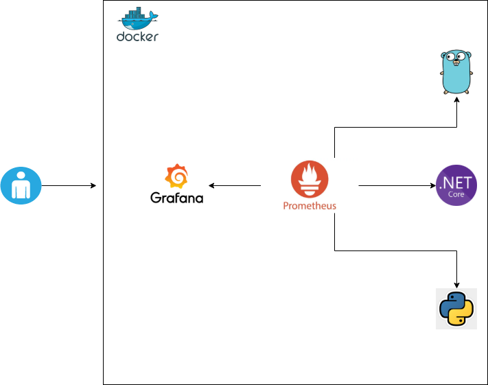

# Prometheus Workshop

## Intro

This workshop will cover

- Fundamental concepts of metrics scraping using Prometheus
- Extending a demo application with Prometheus scraping using built-in and
  custom metrics
- Adding Grafana dashboard to represent Prometheus metrics
- Defining rules for triggering alerts
- Quick overview of exporters to infrastructure tooling

This workshop focuses on presenting a modern approach for collecting metrics
from developed services and infrastructure tools. Prometheus will be used to
collect, query, output metrics and triggering alerts which should be represented
through Grafana.

The workshop is very hands-on, which means the focus is doing exercises with the
tools and instrumenting code that uses those tools.

## Parts

- [Part 0](part0/readme.md): Setup
- [Part 1](part1/readme.md): Prometheus and Grafana
- [Part 2](part2/readme.md): Instrumenting Code
- [Part 3](part3/readme.md): Grafana Dashboards
- [Part 4](part4/readme.md): Alerting

## Prerequisite

- [Docker](https://docs.docker.com/)
    - Prometheus `docker pull prom/prometheus`
    - Grafana `docker pull grafana/grafana`

## Additional resources

- [Prometheus Documentation](https://prometheus.io/docs/)
- [Grafana Documentation](https://grafana.com/docs/)
- [Prometheus/Grafana live-demo](http://demo.robustperception.io:3000/)
- [Prometheus Blog
  Series](https://blog.pvincent.io/2017/12/prometheus-blog-series-part-1-metrics-and-labels/)
